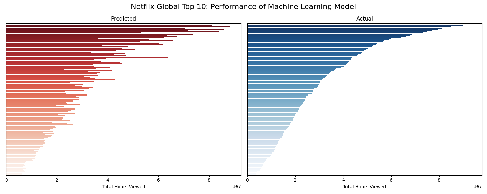

# Netflix Global Top 10 Performance Predictor (Python)

### 🎬 Predicting Netflix Title Performance with machine learning 📊  

Can we predict how many hours a Netflix title will be viewed based on its first two weeks in the Global Top 10? What trends influence what we watch? This project explores these questions using machine learning techniques.  

### 💡Key results:
 - **88.3%** of the variation in total hours viewed is explained by 🌲 Random Forest model   
 - **Week 2 viewership** is the strongest predictor of a Netflix title's success  
 - **Category matters:** 📺 TV shows tend to perform better than 🍿 Films   

### 📊 Statistical Approach:
 -  **Data Preprocessing:** removed outliers beyond the IQR for model robustness  
 -  **Machine Learning:** tested Decision Tree, Random Forest, Gradient Boosting, and XGBoost models  
 -  **Hyperparameter Tuning:** used GridSearchCV to optimise model parameters   
 -  **Model Evaluation:** evaluated model performance using R², adjusted R², and Mean Squared Error (MSE)  
 -  **Python packages:** used Pandas, Matplotlib, Scikit-learn (sklearn)  

### 🔗 Project Resources:
📖 Jupyter Notebook: [GitHub](https://github.com/dpb24/netflix-global-top-10-performance-predictor-ml/blob/main/netflix-global-top-10-performance-predictor-ml.ipynb) | [Kaggle](https://www.kaggle.com/code/davidpbriggs/netflix-global-top-10-performance-predictor-ml)   
📂 Dataset: [Netflix Global Top 10 weekly data](https://www.kaggle.com/datasets/davidpbriggs/most-popular-netflix-shows)  

    
    
    

