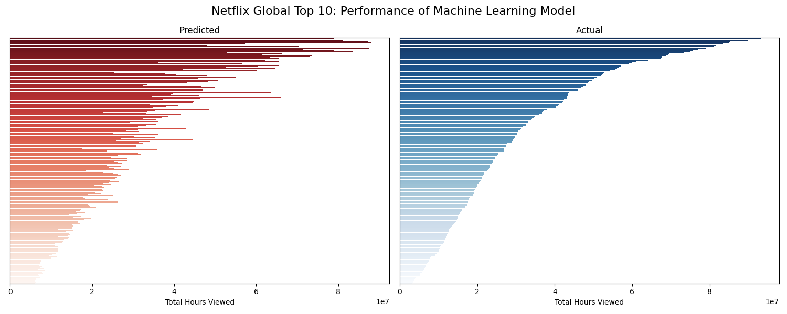
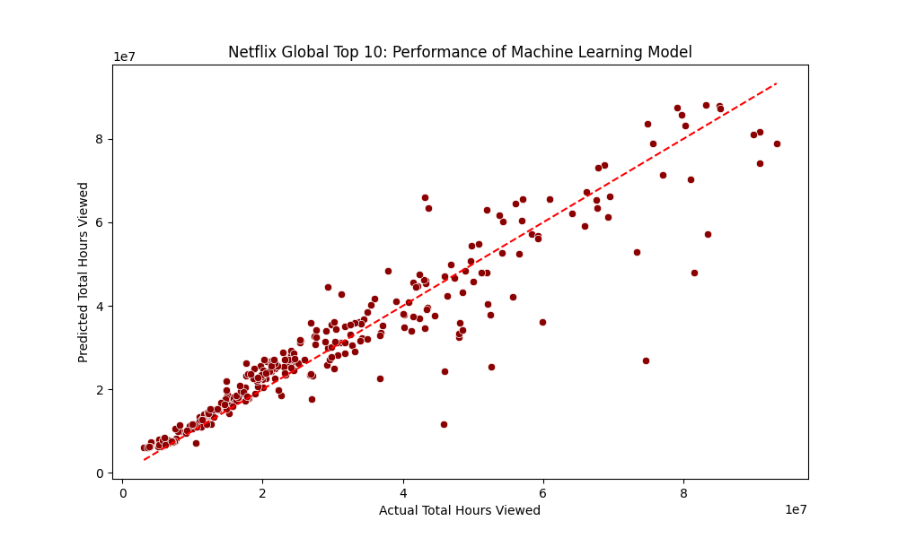

# Netflix Global Top 10 Performance

Can we predict how many hours a Netflix title will be viewed based on its first two weeks in the Global Top 10? What trends influence what we watch? This project explores these questions using both classical statistical methods and modern machine learning techniques.  

### 🔍 Project Overview
 - 📈 Built and compared multiple models to predict a title's **total viewing hours**
 - 📊 Started with **multiple linear regression** to establish statistical significance and understand key predictors
 - 🤖 Progressed to **machine learning models** (Random Forest, Gradient Boosting, XGBoost) to improve prediction accuracy

### 💡Key results:
 - **88.3%** of variation in total hours viewed explained by 🌲 **Random Forest model**   
 - 📺 **TV shows** tend to perform better than 🍿 **Films**  
 - **Week 2 viewership** is strongest predictor of Netflix title's success  

### ⚙️ Methods & Techniques
#### Multiple Linear Regression
 - Data Preprocessing: log transformation, IQR-based outlier removal
 - Model Diagnostics: checked assumptions (homoscedasticity, multicollinearity, Q-Q plots)
 - ANOVA & Tukey's Test: tested category differences in viewership
 - 📖 Jupyter Notebook: [GitHub](https://github.com/dpb24/netflix-global-top-10-performance-predictor/blob/main/notebooks/netflix-global-top-10-performance-predictor-lr.ipynb) | [Kaggle](https://www.kaggle.com/code/davidpbriggs/netflix-global-top-10-performance-predictor-lr)   
 
#### Machine Learning Models
 - Models Evaluated: Decision Tree, Random Forest, Gradient Boosting, XGBoost
 - Hyperparameter Tuning: GridSearchCV
 - Metrics Used: R², Adjusted R², Mean Squared Error (MSE)
 - 📖 Jupyter notebook: [GitHub](https://github.com/dpb24/netflix-global-top-10-performance-predictor/blob/main/notebooks/netflix-global-top-10-performance-predictor-ml.ipynb) | [Kaggle](https://www.kaggle.com/code/davidpbriggs/netflix-global-top-10-performance-predictor-ml)   

    
    
    

