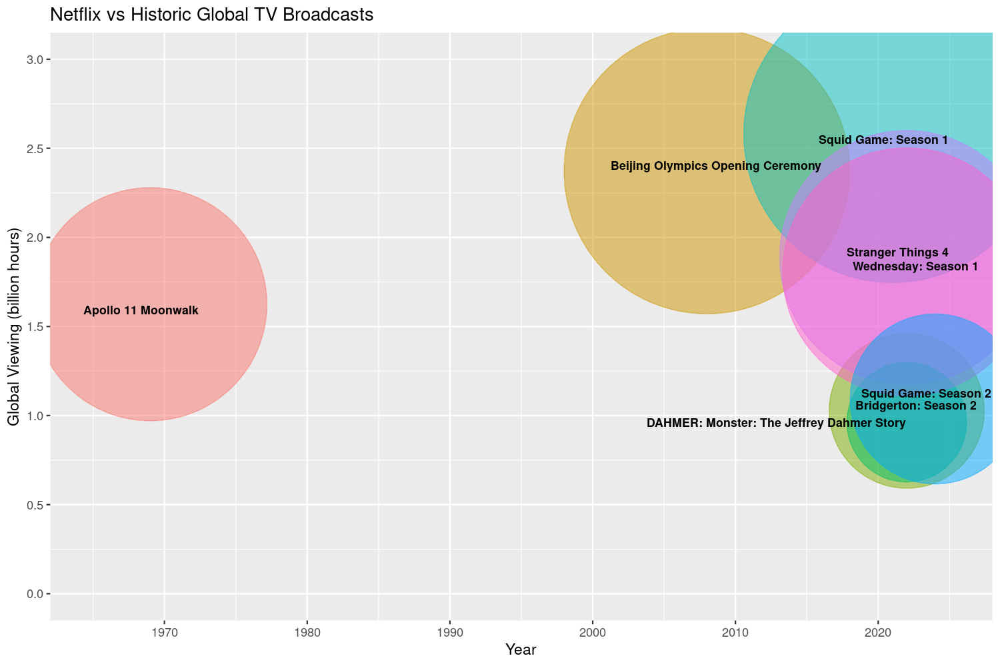
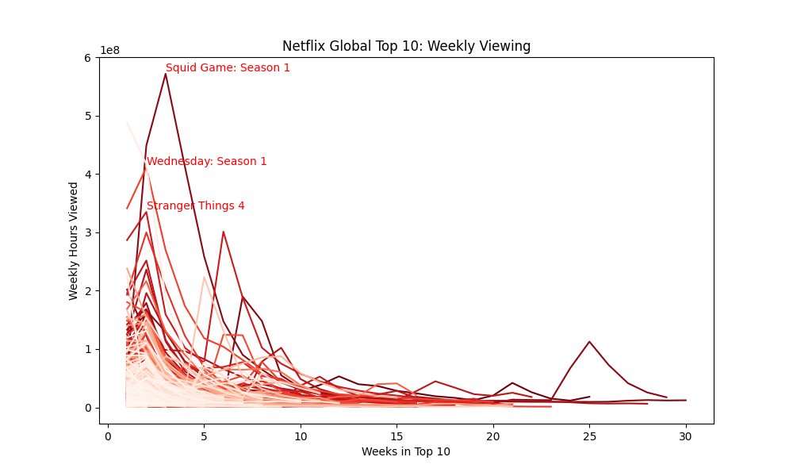
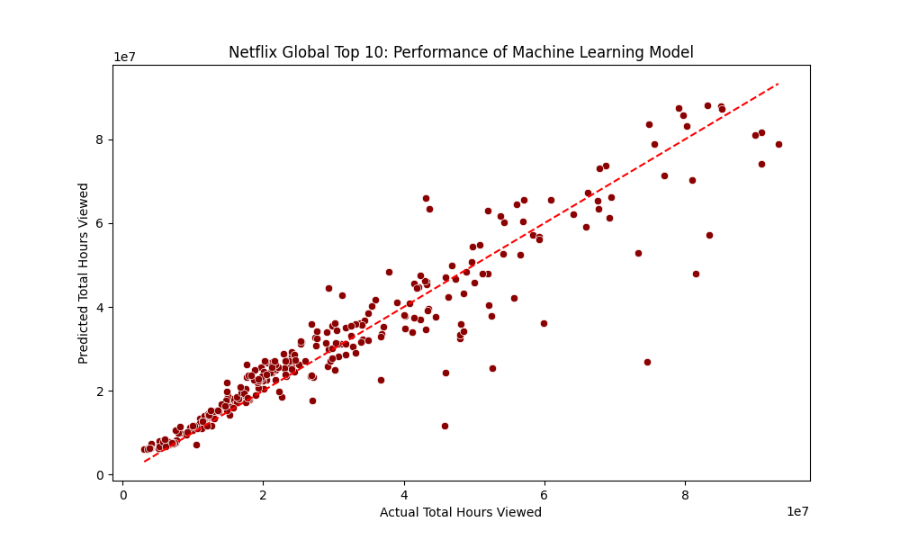

    

# Netflix Global Top 10 Performance

**Libraries:** `scikit-learn`, `XGBoost`, `matplotlib`, `pandas`, `numpy`  
**Dataset:** [Netflix Global Top 10](https://www.kaggle.com/datasets/davidpbriggs/most-popular-netflix-shows)

Can we predict how many hours a Netflix title will be viewed based on its first two weeks in the Global Top 10? What trends influence what we watch? This project explores these questions using both classical statistical methods and modern machine learning techniques.  

### 🔍 Project Overview
- 📈 **R Viewership Analysis**: explored Netflix Global Top 10 trends and benchmarked against historical global TV audiences
- 📊 **Multiple Linear Regression**: developed a baseline statistical model to assess the significance of early viewership metrics
- 🤖 **Machine Learning**: tuned and evaluated ensemble models to enhance predictive accuracy

### 💡Key results:
 - Humanity has spent more time watching **Squid Game: Season 1** than the Moon landings 🌕
 - Live TV still affects streaming demand: viewership for **Stranger Things 4** dropped during the FIFA World Cup qualifiers ⚽
 - 📺 **TV shows** tend to perform better than 🍿 **Films**  
 - 🌲 **Random Forest** came out top with R² of **88.3%** 
 - **Week 2 viewership** was strongest predictor of a title's success  

### ⚙️ Methods & Techniques
#### R Viewership Analysis
 - Visualised trends using ggplot2
 - Estimated global viewership per show
 - 📖 Jupyter Notebook: [GitHub](https://github.com/dpb24/netflix-global-top-10-performance/blob/main/r-viewership-analysis/netflix-most-popular-shows.ipynb) | [Kaggle](https://www.kaggle.com/code/davidpbriggs/netflix-most-popular-shows)   
 
#### Multiple Linear Regression
 - Data Preprocessing: log transformation, IQR-based outlier removal
 - Model Diagnostics: checked assumptions (homoscedasticity, multicollinearity, Q-Q plots)
 - ANOVA & Tukey's Test: tested category differences in viewership
 - 📖 Jupyter Notebook: [GitHub](https://github.com/dpb24/netflix-global-top-10-performance/blob/main/python-linear-regression/netflix-global-top-10-performance-predictor-lr.ipynb) | [Kaggle](https://www.kaggle.com/code/davidpbriggs/netflix-global-top-10-performance-predictor-lr)   
 
#### Machine Learning Models
 - Models Evaluated: Decision Tree, Random Forest, Gradient Boosting, XGBoost
 - Hyperparameter Tuning: GridSearchCV
 - Metrics Used: R², Adjusted R², Mean Squared Error (MSE)
 - 📖 Jupyter notebook: [GitHub](https://github.com/dpb24/netflix-global-top-10-performance/blob/main/python-ml-model/netflix-global-top-10-performance-predictor-ml.ipynb) | [Kaggle](https://www.kaggle.com/code/davidpbriggs/netflix-global-top-10-performance-predictor-ml)     

    
    
    
    

